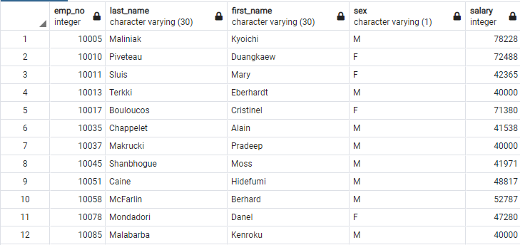

# Employee Database: A Mystery in Two Parts  

### As a newly hired data engineer at Pewlett Hackard. My first major task is a research project on employees of the corporation from the 1980s and 1990s. Using six CSV files from the employees database I will answer the following questions: 

   1. List the following details of each employee: employee number, last name, first name, sex, and salary.  
   2. 
   3. List first name, last name, and hire date for employees who were hired in 1986.
   4. List the manager of each department with the following information: department number, department name, the manager's employee number, last name, first name.
   5. List the department of each employee with the following information: employee number, last name, first name, and department name.
   6. List first name, last name, and sex for employees whose first name is "Hercules" and last names begin with "B."
   7. List all employees in the Sales department, including their employee number, last name, first name, and department name.
   8. List all employees in the Sales and Development departments, including their employee number, last name, first name, and department name.
   9. In descending order, list the frequency count of employee last names, i.e., how many employees share each last name.
